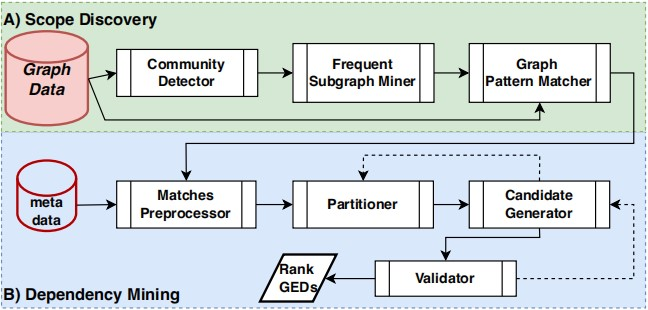

# README
## Discovering Graph Entity Dependencies 
Graph entity dependencies (GEDs) are novel graph constraints, unifying keys and functional dependencies, for property graphs. In this work, we study the discovery problem of GEDs – finding a minimal cover of valid GEDs in a given graph data. We formalise the problem, and propose an effective and efficient approach to overcome major bottlenecks in GED discovery. The figure presents the overall pipeline of our solution, consisting of two main components for: (a) finding representative and reduced graph patterns (i.e.,
“scopes”) and their (homomorphic) matches in the graph; and (b) finding minimal attribute (entity) dependencies that holds over the graph patterns.  
<div align=center>
 
</div>

## Requirements
- Java 1.8
- Python 3

## Preliminaries
Due to space limitations, missing files are saved [here](), and the source code can also be found.

## Execution Steps
We divide the GED mining process into the following three steps: 
1. **Frequent Subgraph Mining**:
   - input data in folder: `resource/`
   - output data in the folder: `test/process_1_producer/queryGraph`
   - run command: `java -jar GraMi_ExactSubgraphMatching-1.0-SNAPSHOT.jar filename=graph.lg datasetFolder=resource/ freq=20`
   - parameters: `filename` refers to the target graph data file, `datasetFolder` indicates the folder where the graph data is located, `freq` set frequency threshold.
2. **Homomorphic Subgraph Matching**:
   - input data in folder: `test/process_1_producer/purePattern2`
   - output data in the folder: `test/process_2_producer/pre_Table`
   - run command: `java -jar graphflow-0.1.0.jar`
3. **Dependency Mining**:
   - input data in folder: `test/process_2_producer/pre_Table`
   - output data in the folder: `result/`
   - run command: `java -jar GEDdependencyMining-1.0-SNAPSHOT.jar /path/to/python /path/to/dependency_mining.py /path/to/ -1 -1`
   - parameters: `/path/to/python` represents the current Python compiler path, `/path/to/dependency_mining.py` indicates the path to the dependency mining Python file, `/path/to` indicates the folder path where the current jar package is located, the first `-1` represents the limit on the number of attributes in the mining data table\[-1 represents unlimited\], the second `-1` represents the limit on the number of rows in the mining data table\[-1 represents unlimited\].

## Running Example
We provide an toy example dataset in the folder `resource/`, you can complete the above three steps by executing the following command: 
```
sh run.sh
```
You can change all the parameters in `run.sh`, and the mined GEDs is recorded in the folder `result/`.  
